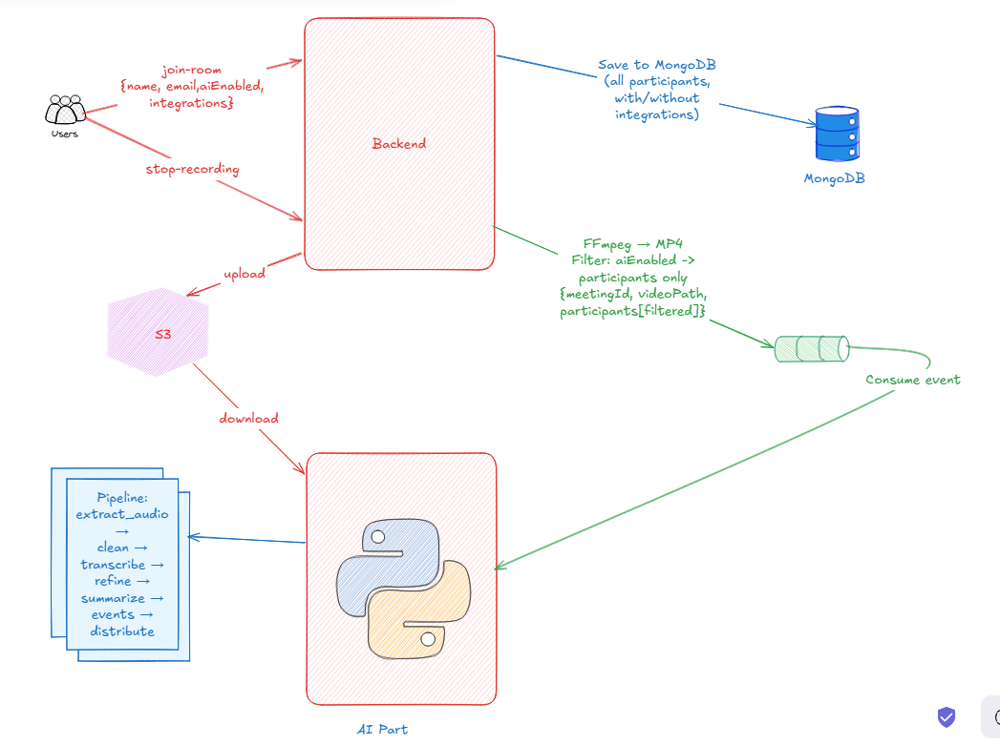
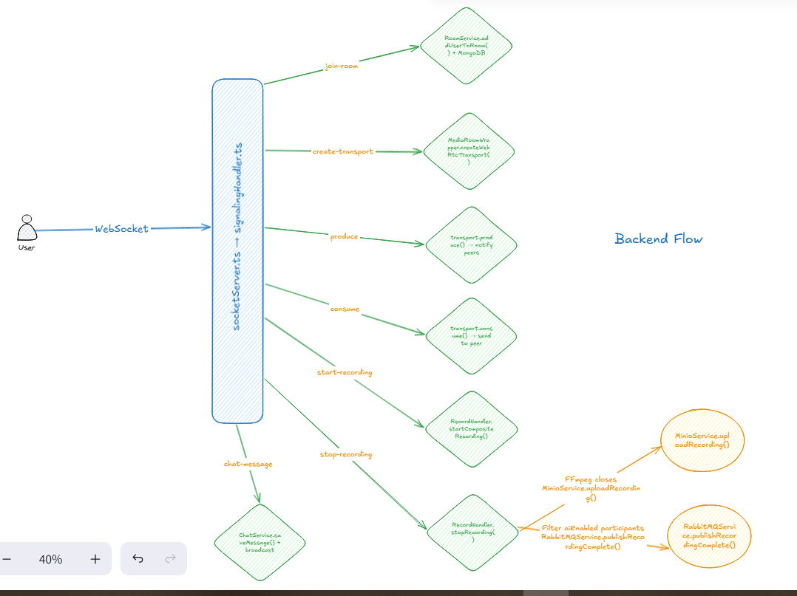
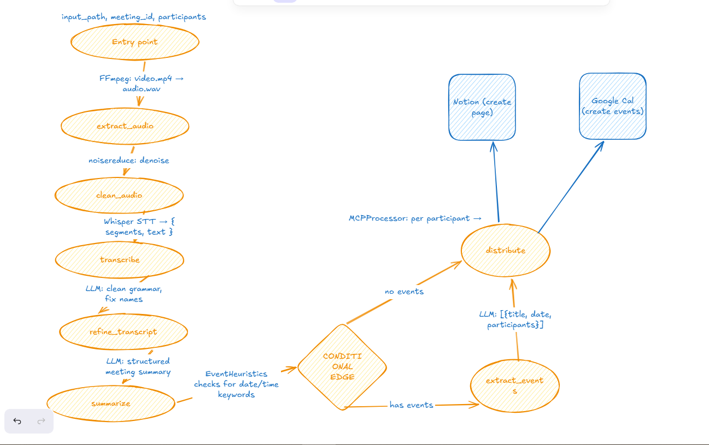

# 🚀 WebRTC AI-Powered Meeting Platform

> A full-stack, real-time video conferencing platform with **AI-powered meeting intelligence** — featuring live video/audio, chat, composite recording, automatic transcription, summarization, event extraction, and distribution to **Notion** and **Google Calendar**.

---

## 📖 Overview

This project is an end-to-end video conferencing application that combines the power of **WebRTC** (via mediasoup SFU) with an **AI processing pipeline** to transform meetings into actionable outputs. Participants can join rooms, communicate through video, audio, and chat, record meetings, and opt-in to AI features that automatically transcribe, summarize, and extract calendar events from the recording — then distribute the results to each participant's connected productivity tools.

---

## 🏛️ Architecture

### System Design



### Backend Flow



### AI Pipelines



---

## 📦 Project Structure

| Directory | Description | README |
|---|---|---|
| [`frontend/`](./frontend/) | React + TypeScript video conferencing UI | [📖 Frontend README](./frontend/README.md) |
| [`backend/`](./backend/) | Node.js signaling server, mediasoup SFU, chat, recording | [📖 Backend README](./backend/README.md) |
| [`ai/`](./ai/) | Python AI pipeline — transcription, summarization, distribution | [📖 AI README](./ai/README.md) |
| `docker-compose.yml` | Infrastructure services (RabbitMQ, MongoDB, MinIO) | — |

---

## ✨ Key Features

### 📹 Real-Time Video Conferencing
- **mediasoup SFU** — Scalable Selective Forwarding Unit for multi-party video/audio.
- **Adaptive Video Grid** — Dynamic participant layout with camera, mic, and screen sharing controls.
- **Screen Sharing** — Full-screen share with other meeting participants.

### 💬 In-Meeting Chat
- **Persistent Messages** — Chat messages stored in MongoDB with history and pagination.
- **System Notifications** — Automatic messages for join/leave and recording events.

### 🎥 Composite Recording
- **Server-Side Recording** — All participants combined into a single MP4 via FFmpeg.
- **MinIO Storage** — Recordings automatically uploaded to S3-compatible object storage.

### 🤖 AI-Powered Meeting Intelligence
- **Automatic Transcription** — Whisper-based speech-to-text with segment-level timestamps.
- **Transcript Refinement** — LLM cleans up transcription artifacts for readability.
- **Meeting Summarization** — Key points, decisions, and action items extracted by LLM.
- **Calendar Event Extraction** — Schedulable follow-ups detected and structured as events.
- **Smart Gating** — Heuristic check skips event extraction when not applicable.

### 🔄 Productivity Integration (MCP)
- **Notion** — Meeting summaries and transcript pushed to participant's Notion workspace.
- **Google Calendar** — Extracted events created as calendar entries.
- **Per-Participant** — Each participant independently chooses their integrations.

### 🔗 Event-Driven Architecture
- **RabbitMQ** — Decoupled backend ↔ AI communication via `recording.completed` events.
- **Independent Scaling** — Backend and AI services can scale independently.
- **Fault Isolation** — AI pipeline failures don't affect the meeting experience.

---

## 🏗️ Tech Stack

### Frontend
| Tech | Purpose |
|---|---|
| React 18 + TypeScript | UI framework |
| Vite 5 | Build & dev server |
| mediasoup-client | WebRTC SFU client |
| TailwindCSS | Styling |

### Backend
| Tech | Purpose |
|---|---|
| Node.js + TypeScript | Runtime |
| Express 5 | HTTP API |
| WebSocket (ws) | Real-time signaling |
| mediasoup 3 | SFU media server |
| MongoDB + Mongoose | Data persistence |
| MinIO (AWS SDK v3) | Object storage |
| RabbitMQ (amqplib) | Event messaging |
| FFmpeg | Video recording |

### AI Service
| Tech | Purpose |
|---|---|
| Python 3.12+ | Runtime |
| FastAPI | REST API |
| LangGraph + LangChain | Pipeline orchestration |
| Whisper / WhisperX | Speech-to-text |
| OpenAI / Gemini / Ollama | LLM providers |
| aio-pika | Async RabbitMQ client |
| Notion Client | Notion API |
| Google Calendar API | Calendar integration |

### Infrastructure
| Tech | Purpose |
|---|---|
| RabbitMQ | Message broker |
| MongoDB | Document database |
| MinIO | S3-compatible object storage |
| Docker Compose | Service orchestration |

---

## 🚀 Getting Started

### Prerequisites
- **Node.js** ≥ 18 with **pnpm**
- **Python** ≥ 3.12 with **uv** (or pip)
- **FFmpeg** installed and on `PATH`
- **Docker** & **Docker Compose**
- **Linux / WSL / macOS** (Windows native is not supported due to mediasoup)

### 1. Start Infrastructure

```bash
docker compose up -d
```

This starts **RabbitMQ** (ports 5672, 15672), **MongoDB** (port 27017), and **MinIO** (ports 9000, 9001).

### 2. Start the Backend

```bash
cd backend
pnpm install
pnpm dev
# → Runs on http://localhost:3000
```

### 3. Start the AI Service

```bash
cd ai
uv sync
uv run uvicorn main:app --host 0.0.0.0 --port 8000 --reload
# → Runs on http://localhost:8000
```

### 4. Start the Frontend

```bash
cd frontend/react
pnpm install
pnpm dev
# → Runs on http://localhost:5173
```

### 5. Open the App

Navigate to `http://localhost:5173`, enter a room code and your name, and start your meeting!

---

## 🔄 End-to-End Flow

1. **User joins a room** via the frontend, optionally enabling AI with Notion/Calendar integration tokens.
2. **WebSocket signaling** establishes mediasoup WebRTC transports for bidirectional media.
3. **Video, audio, and chat** flow in real time through the SFU.
4. **Recording starts** — the backend captures all participant streams into a composite MP4 via FFmpeg.
5. **Recording stops** — the MP4 is uploaded to MinIO, and a `recording.completed` event is published to RabbitMQ.
6. **AI pipeline triggers** — the AI service downloads the recording and processes it through the LangGraph pipeline:
   - Extract audio → Clean audio → Transcribe (Whisper) → Refine transcript (LLM) → Summarize (LLM) → Extract events (LLM, conditional) → Distribute
7. **Results distributed** — The meeting summary is pushed to each participant's Notion, and extracted events are created in their Google Calendar.

---

## 📂 Detailed Documentation

Explore the README for each component:

| Component | Link |
|---|---|
| 🖥️ **Frontend** — React Video Conferencing UI | [Frontend README →](./frontend/README.md) |
| 📡 **Backend** — Signaling, SFU & Recording | [Backend README →](./backend/README.md) |
| 🧠 **AI Service** — Meeting Intelligence Pipeline | [AI README →](./ai/README.md) |

---

## 📄 License

This project is licensed under the **MIT License**.

